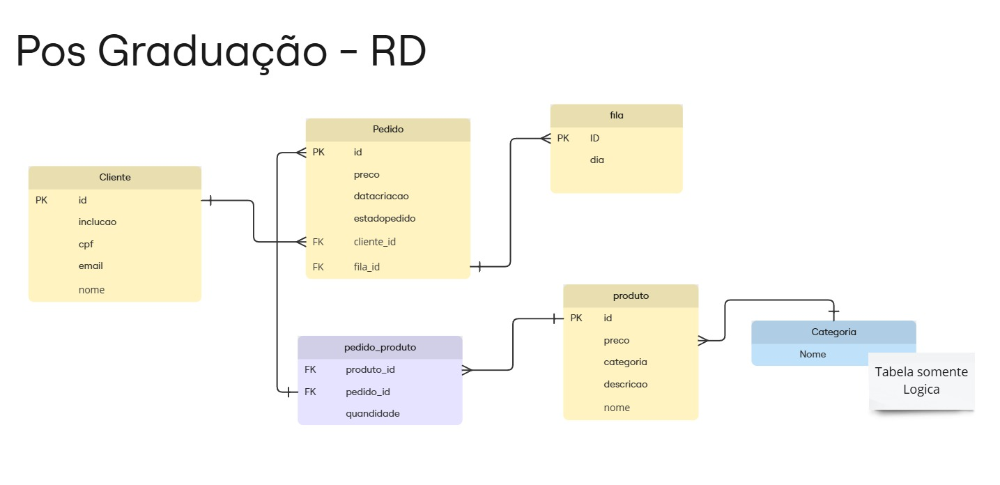

# 🍔 Lanchonete PosFiap 
   

## Sobre o Projeto

Esse e um projeto do Tech Challenge fiap, sobre uma uma lanchonete de bairro que está expandindo devido seu grande sucesso. Implementar um sistema de controle de pedidos, possa atender os clientes de maneira eficiente, gerenciando seus pedidos e estoques de forma adequada

Este repositório contém a estrutura do banco de dados para o sistema **POS Lanchonete**, um sistema de ponto de venda voltado para lanchonetes.

## 🚀 Tecnologias Utilizadas

- **PostgreSQL**: Utilizado como SGBD para o gerenciamento dos dados.
- **Terraform**: Utilizado para a Criação da infrastrutura
- **AWS RDS** : Tecnologia Utilizada para o gerenciamento do SGBD

## ⚙️ Pré-requisitos

- **PostgreSQL** instalado na sua máquina.
- Um usuário com permissões para criar bancos de dados e tabelas.

## :interrobang: Obs
Nesse Repositorio estar a criação do **VPC**, e do **Securit Group**

## Modelo do Banco

## 📝 Licença

Este projeto está sob a licença [MIT](./LICENSE). Consulte o arquivo para mais informações.